# 📱 NASA Space Events Dashboard - Frontend

> Interfaccia utente interattiva per visualizzare e analizzare eventi spaziali NASA

[](https://flutter.dev/)
[](https://m3.material.io/)
[]()

---

## 📋 Cos'è Questo Progetto?

Il **frontend** del NASA Space Events Dashboard è l'interfaccia che gli utenti vedono e utilizzano. Trasforma dati complessi sugli eventi spaziali in **visualizzazioni intuitive e interattive**.

È come avere una **finestra sullo spazio** che ti permette di:
- 👀 **Vedere** gli eventi spaziali in tempo reale
- 📊 **Esplorare** grafici e statistiche
- 🔍 **Filtrare** i dati per trovare quello che cerchi
- 🔗 **Scoprire** come gli eventi sono connessi tra loro

**Target**: Desktop (Windows), Web Browser, Mobile (Android/iOS)

---

## ✨ Cosa Puoi Fare

### 🏠 Schermata Home - Il Quadro Generale

Prima cosa che vedi quando apri l'applicazione:

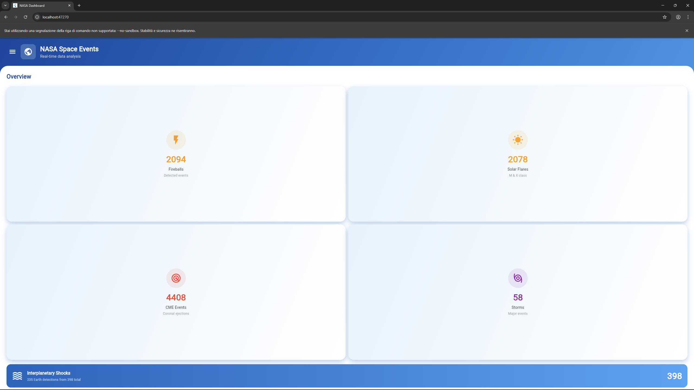
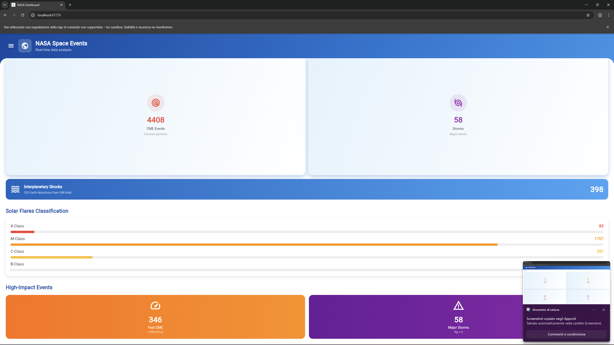


**Cosa vedi**:
- 📊 **Statistiche aggregate**: Quanti eventi per ogni tipo
- 📈 **Grafico mensile**: Trend attività solare nel tempo
- 🎯 **Eventi rilevanti**: Highlight dei più importanti
- 🎨 **Design NASA-inspired**: Colori blu scuro e arancio

---

### 🔬 Schermata Analysis - Correlazioni Scientifiche

Mostra come gli eventi spaziali sono **connessi tra loro**:

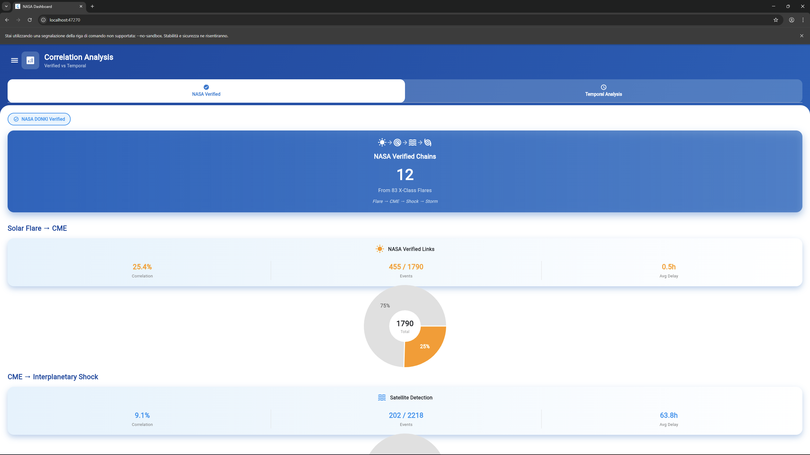
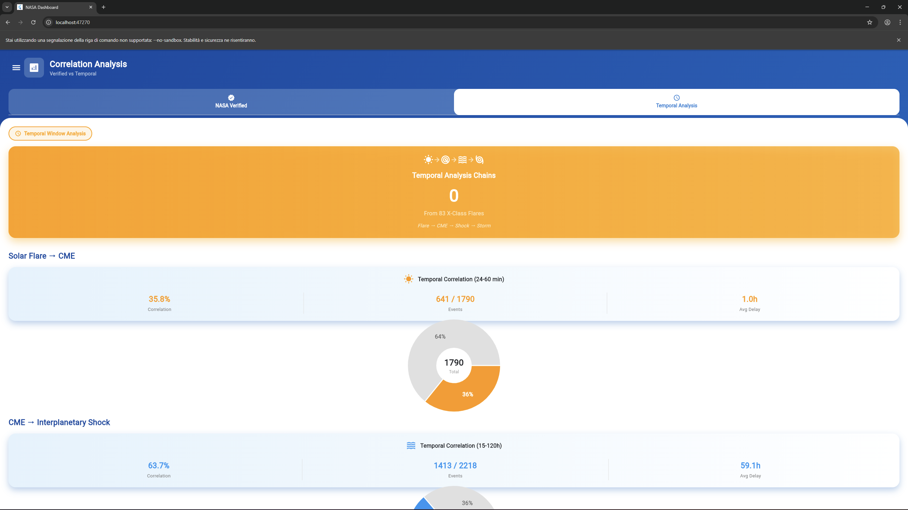


**Cosa fai**:
- 📊 **Vedi metriche**: Percentuali di correlazione, tempi medi
- 📝 **Elenchi dettagliati**: Prime 10 correlazioni con dettagli
- 🔄 **Confronta metodi**: NASA Verified vs Manual Temporal
- 🎯 **Comprendi catene**: Flare → CME → IPS → Storm

**Valore**: Capisci la **fisica degli eventi spaziali** in modo visuale.

---

### ☀️ Schermata Solar Activity - Esplora Ogni Evento

Interfaccia **5-in-1** con tabs per ogni tipo di evento solare:

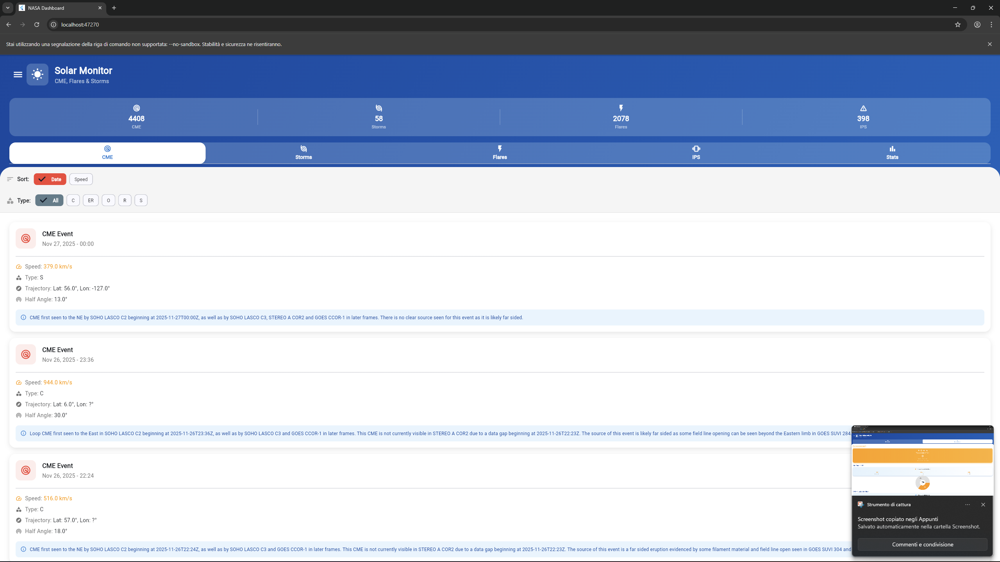
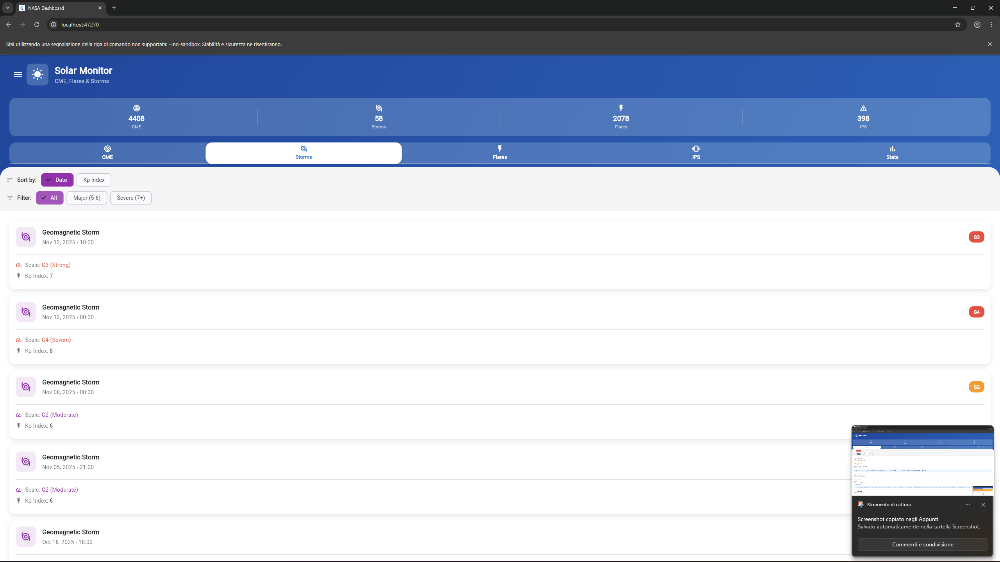
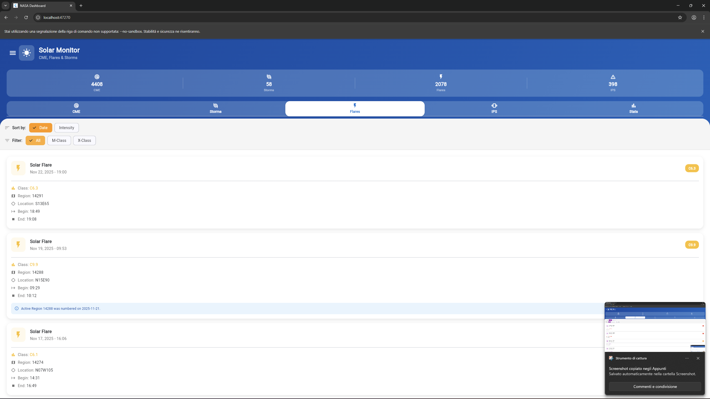
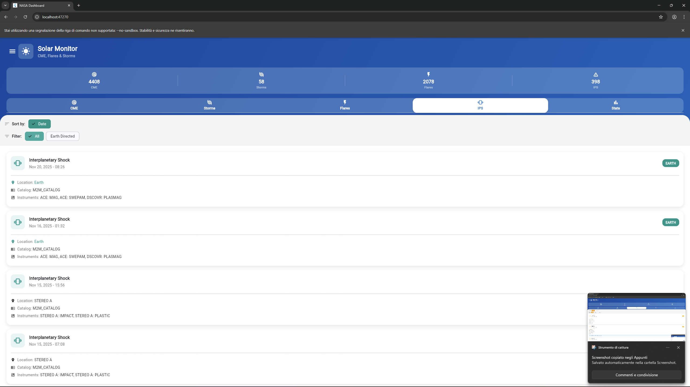


**Tabs disponibili**:

1. **CME** (Coronal Mass Ejections)
    - Filtri: Velocità, Tipo (S/C/O/R)
    - Sort: Data, Velocità
    - Info: Speed, Type, Location, Time

2. **Storms** (Geomagnetic Storms)
    - Filtri: Severità (Major, Severe)
    - Sort: Data, Kp Index, G-Scale
    - Info: Kp Index, G-Scale, Duration, Timeline

3. **Flares** (Solar Flares)
    - Filtri: Classe (All, M-Class, X-Class)
    - Sort: Data
    - Info: Class, Peak Time, Location, Active Region

4. **IPS** (Interplanetary Shocks)
    - Filtri: Location (All, Earth-directed)
    - Sort: Data
    - Info: Time, Location, Catalog

5. **Stats** (Statistiche aggregate)
    - Grafici: Distribuzione classi Flare
    - Charts: CME per mese
    - Breakdown: Percentuali eventi

---

### 🌍 Schermata NEO - Near-Earth Objects

Visualizza **asteroidi** che passano vicino alla Terra:

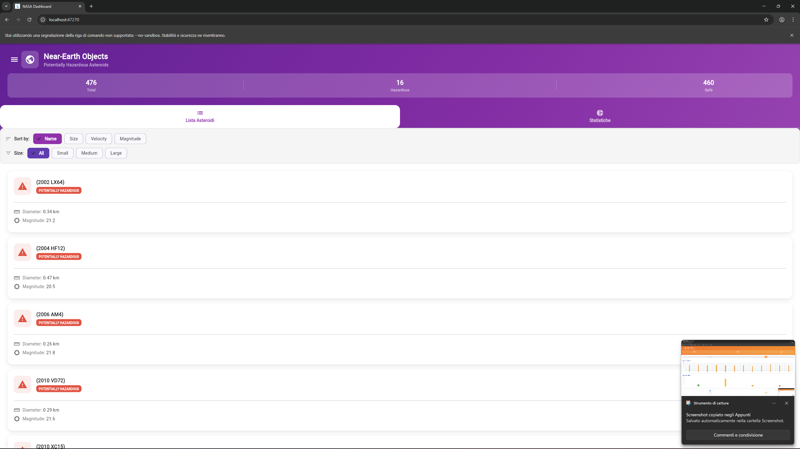
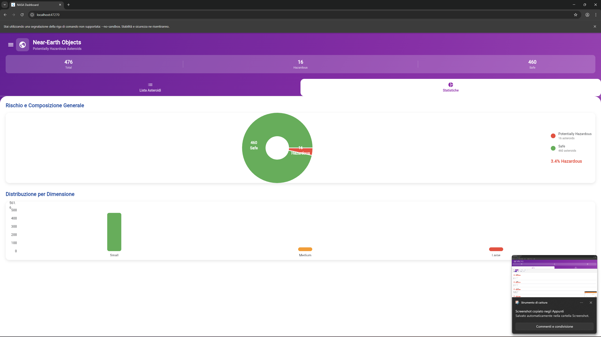


**Cosa vedi**:
- 🔢 **Numero totale**: Quanti asteroidi tracciati
- ⚠️ **Potenzialmente pericolosi**: Evidenziati in rosso
- 📏 **Dimensioni**: Da pochi metri a chilometri
- 🎯 **Distanza**: In AU (Astronomical Units)
- ⚡ **Velocità relativa**: Quanto veloce passa

**Filtri intelligenti**:
- **Very Close**: < 0.01 AU (~1.5 milioni km)
- **Close**: < 0.05 AU (~7.5 milioni km)
- **Small**: < 100m
- **Medium**: 100m - 1km
- **Large**: > 1km

---

### 💥 Schermata Fireballs - Eventi Atmosferici

Bolidi (meteore luminose) osservati sulla Terra:

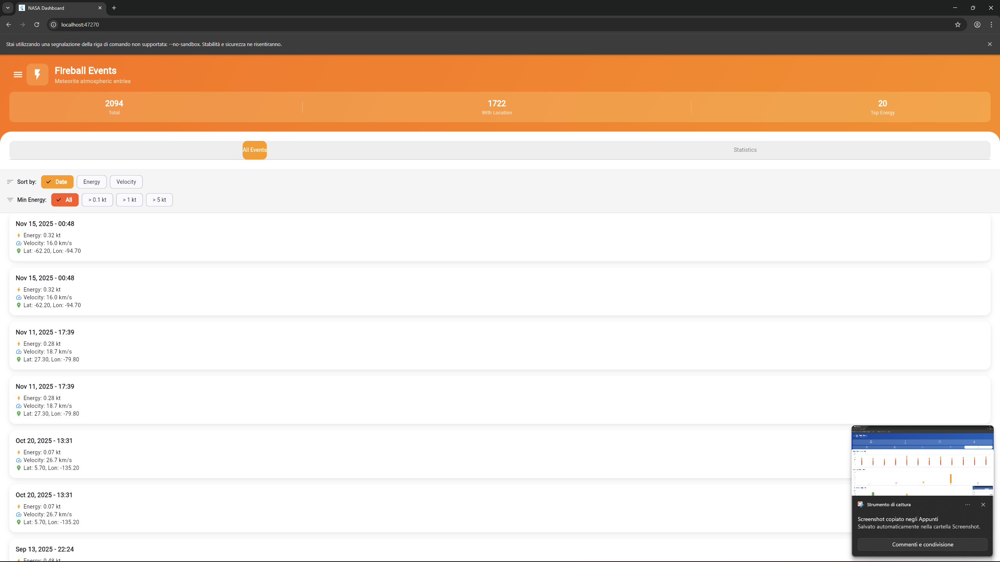
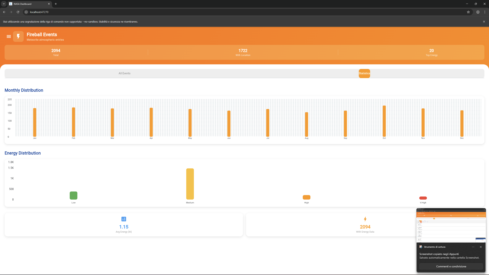


**Info visualizzate**:
- 📍 **Posizione geografica**: Lat/Lon sulla Terra
- ⚡ **Velocità impatto**: km/s
- 💥 **Energia rilasciata**: In kiloton TNT equivalente
- 🔥 **High Energy**: Eventi >1kt evidenziati

**Fun fact**: 1 kiloton = Energia di 1000 tonnellate di TNT!

---

## 📊 Visualizzazioni e Grafici

### Grafico Mensile (Home Screen)

**Stacked Bar Chart** con 4 layer:

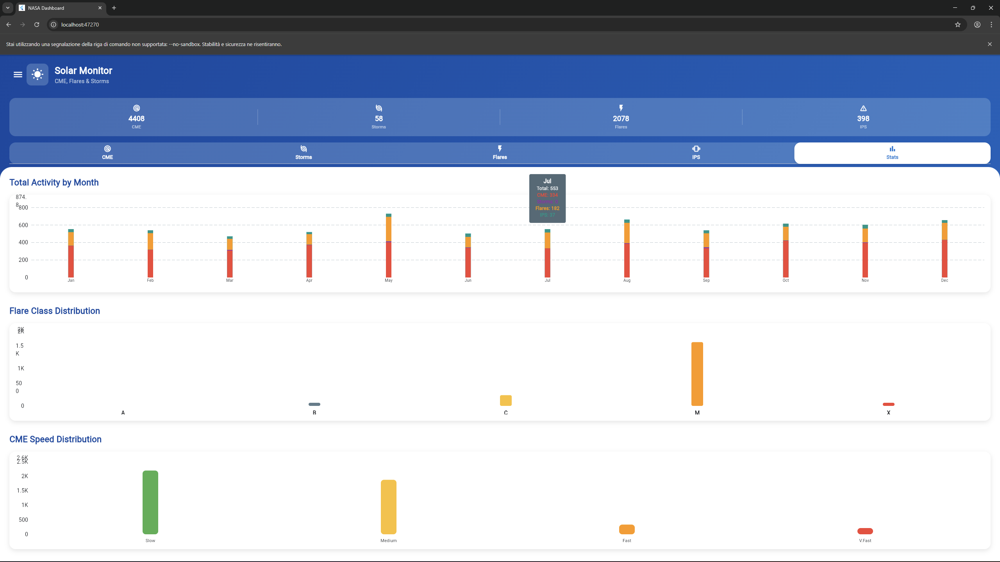


**Interattivo**: Tocca una barra per vedere breakdown dettagliato!

---

### Distribuzione Classi Flare (Stats Tab)

**Pie Chart Colori**:
- 🔴 **X-Class**: Rosso (più intensi)
- 🟠 **M-Class**: Arancio (medi)
- 🔵 **C-Class**: Blu (comuni)

---

## 🎨 Design e User Experience

### Tema NASA-Inspired

**Palette colori**:
```
Primary:   #1a237e (Blu scuro)
Secondary: #ff6f00 (Arancio NASA)
Surface:   #263238 (Grigio scuro)
Text:      #ffffff (Bianco)
Accent:    #00bcd4 (Cyan)
```

**Ispirazione**: Missioni spaziali, console NASA, display tecnici

---

### Material Design 3

- ✅ **Rounded corners**: Design moderno e amichevole
- ✅ **Elevation shadows**: Profondità e gerarchia visiva
- ✅ **Ripple effects**: Feedback tattile su click
- ✅ **Smooth animations**: Transizioni fluide tra schermate

---

### Responsive Layout

**Adatta automaticamente** a diverse dimensioni schermo:

| Device | Layout | Note |
|--------|--------|------|
| **Desktop** | 3-column grid | Schermo grande sfruttato |
| **Tablet** | 2-column grid | Equilibrato |
| **Mobile** | Single column | Ottimizzato touch |

---

## 🔍 Sistema di Filtri

### Filtri Disponibili per Schermata

| Screen | Sort Options | Filter Options |
|--------|--------------|----------------|
| **CME** | Date, Speed | Speed (Fast >1000), Type (S/C/O/R) |
| **Flares** | Date | Class (All, M-Class, X-Class) |
| **Storms** | Date, Kp, G-Scale | Severity (All, Major G1-G2, Severe G3+) |
| **IPS** | Date | Location (All, Earth Directed) |
| **NEO** | Date, Approach, Diameter, Velocity | Distance, Size |
| **Fireballs** | Date, Energy, Velocity | Energy (>1kt) |

### Come Funzionano

**Esempio - Filtrare CME veloci**:
1. Vai su Solar Activity → Tab CME
2. Spunta "Fast Only (>1000 km/s)"
3. Lista si aggiorna in tempo reale
4. 847 → 189 eventi (solo veloci)

**Esempio - Ordinare tempeste per intensità**:
1. Vai su Solar Activity → Tab Storms
2. Click su "Sort by: G-Scale"
3. Eventi riordinati: G5 in alto, G1 in basso

---

## 🏗️ Come È Costruito

### Architettura Semplificata

```
┌─────────────────────────────────────────┐
│         USER INTERFACE (5 Screens)      │
│  Home, Analysis, Solar, NEO, Fireballs  │
└────────────┬────────────────────────────┘
             │
             │ User interactions
             ▼
┌─────────────────────────────────────────┐
│      WIDGETS & COMPONENTS               │
│  • Cards                                │
│  • Charts (fl_chart)                    │
│  • Lists                                │
│  • Filters                              │
└────────────┬────────────────────────────┘
             │
             │ Data requests
             ▼
┌─────────────────────────────────────────┐
│         API SERVICE LAYER               │
│  HTTP calls to Backend REST API         │
└────────────┬────────────────────────────┘
             │
             │ JSON data
             ▼
┌─────────────────────────────────────────┐
│      BACKEND (Spring Boot)              │
│  Returns space events data              │
└─────────────────────────────────────────┘
```

**Flusso dati**:
1. User clicca "Solar Activity"
2. Widget chiede dati ad API Service
3. API Service fa HTTP GET al backend
4. Backend restituisce JSON
5. Widget visualizza dati in liste/grafici

---

## 💻 Stack Tecnologico

### Framework e Linguaggio

- **Flutter 3.x** - Framework UI cross-platform di Google
- **Dart 3.x** - Linguaggio moderno e performante

### Librerie Chiave

- **fl_chart 0.66.2** - Grafici interattivi bellissimi
- **http** - Client per chiamate REST API
- **Material Design 3** - Componenti UI moderni

### Perché Flutter?

**Cross-Platform**:
- ✅ **1 codebase** → Windows + Web + Android + iOS
- ✅ **Native performance**: Compila a binario nativo
- ✅ **Hot reload**: Sviluppo rapidissimo

**UI Eccellente**:
- ✅ **Material Design**: Componenti ready-to-use
- ✅ **Customizzabile**: Ogni pixel controllabile

**Sviluppo Veloce**:
- ✅ **Widget library ricca**: Meno codice da scrivere
- ✅ **Hot reload**: Vedi cambiamenti in 1 secondo
- ✅ **Null-safety**: Meno bug, più stabilità

---

## 📱 Piattaforme Supportate

### Windows Desktop ✅

- **Target primario** per questo progetto
- Build nativo .exe
- Performance native
- Window resizable

### Web Browser ✅

- Compilato in JavaScript
- Funziona su Chrome, Firefox, Safari
- Responsive design
- URL sharing possibile

### Android ✅

- Build APK/AAB
- Touch-optimized
- Performance native

### iOS ✅

- Build .ipa
- Richiede macOS per build
- AppStore ready

---

## 🚀 Come Si Usa

### Prerequisiti

- **Flutter SDK 3.x+**
- **Backend in esecuzione** su http://localhost:8080

### Setup Rapido

1. **Installa dipendenze**:
```bash
cd frontend
flutter pub get
```

2. **Avvia app**:
```bash
# Windows desktop
flutter run -d windows

# Web browser
flutter run -d chrome

# Android (con emulatore attivo)
flutter run -d android
```

3. **Esplora**:
- Home: Panoramica generale
- Analysis: Correlazioni
- Solar Activity: Eventi solari
- NEO: Asteroidi
- Fireballs: Bolidi

---

## 📚 Documentazione Completa

Questo README è **non-tecnico** per una visione d'insieme accessibile.

**Per dettagli tecnici completi**, consulta:
- **README_FRONTEND.md** - Setup, architettura, widget structure
- **Technical Report** - Design decisions, performance analysis

---

## 🎓 Sfide UI/UX Risolte

### 1. Troppi Dati, Poco Spazio

**Problema**: Come mostrare 1000+ eventi senza confondere?

**Soluzione**:
- ✅ **Tabs**: Organizza per tipo (5 tabs Solar Activity)
- ✅ **Filtri**: Mostra solo eventi rilevanti
- ✅ **Pagination**: 50 items per pagina
- ✅ **Summary cards**: Info essenziale subito visibile

---

### 2. Filtri Intuitivi

- ✅ **Label chiari**: "Fast CME" invece di ">1000 km/s"
- ✅ **ChoiceChips**: Visibili e touch-friendly
- ✅ **Reset button**: Chiaro come tornare a default
- ✅ **Count update**: "847 → 189 events" mostra effetto

---

### 4. Performance su Mobile

**Problema**: App lenta su dispositivi entry-level

**Soluzione**:
- ✅ **Lazy loading**: Carica solo eventi visibili
- ✅ **Image caching**: Evita reload ripetuti
- ✅ **Debounce filters**: Aspetta 300ms prima di filtrare

---

## 📈 Possibili Evoluzioni UI

### Funzionalità

- [ ] **Dark/Light mode toggle**: Tema chiaro opzionale
- [ ] **Export to CSV**: Download dati filtrati
- [ ] **Bookmarks**: Salva eventi preferiti
- [ ] **Notifications**: Alert per eventi critici
- [ ] **3D globe**: Visualizza fireballs su mappa 3D
- [ ] **Comparison mode**: Side-by-side eventi

### Visualizzazioni

- [ ] **Timeline view**: Eventi su linea temporale
- [ ] **Heat map**: Intensità attività per giorno
- [ ] **Network graph**: Correlazioni come grafo
- [ ] **Animated transitions**: Mostra propagazione evento
- [ ] **AR view**: Orbite NEO in realtà aumentata

### UX Improvements

- [ ] **Onboarding tutorial**: Guide per new users
- [ ] **Search bar**: Cerca eventi per ID o data
- [ ] **Keyboard shortcuts**: Power users (Ctrl+F = filter)
- [ ] **Offline mode**: Cache ultimi dati scaricati
- [ ] **Multi-language**: Italiano, Inglese, Spagnolo

---

## 👤 Informazioni

**Progetto**: NASA Space Events Dashboard - Frontend  
**Sviluppatore**: Andrea Roberto Benvenuti 
**Data**: 23 novembre 2025 - 27 novembre 2025  
**Contesto**: Test Tecnico Developer - Dynamic Consult Milano

### Repository Correlati

- **Backend**: [nasa-backend](https://github.com/[username]/nasa-backend) - Spring Boot API
- **Main**: [nasa-dashboard](https://github.com/[username]/nasa-dashboard) - Progetto completo

---

## 🙏 Credits

- **NASA**: Per dati spaziali pubblici
- **Flutter Team**: Framework eccellente
- **Material Design**: Design system
- **fl_chart**: Libreria grafici

---

<div align="center">

**L'interfaccia è il ponte tra dati complessi e comprensione umana.** 🎨

Un'ottima UI non si vede, ma si sente nell'intuitività dell'esperienza.

</div>

---

## 📧 Contatti

* **Email:** [benve31@gmail.com](mailto:benve31@gmail.com)
* **GitHub:** [AndreaRobertoBenvenuti](https://github.com/AndreaRobertoBenvenuti)
* **LinkedIn:** [Andrea Roberto Benvenuti](https://www.linkedin.com/in/andrea-roberto-benvenuti-210835329/)


**Licenza**: Educational - Test Tecnico  
**Versione**: 1.0  
**Piattaforme**: Windows, Web, Android, iOS